# Proyecto Final Campus
# Integrantes : 

- Adrián Rodríguez.
- Isabel Calzadilla.
- Joan Rofes.

<h1 style="text-align: center; color : blueviolet ">Nombre de Aplicación : T-Eats.</h1>

<h2>Proyecto : </h2>

<h5>El proyecto tiene como finalidad principal : descongestionar y optimizar la plataforma de petición de turnos de reservas en el comedor, siendo ésta una de las principales problemáticas que se presentan en una macro-empresa, con especial mención a T-Systems, es por ello que todo nuestro abordaje se enfocó en la usabilidada, practicidad y optimización de los recursos para tal fin, haciendo uso de múltiples tareas y tecnologías para ello.
</h5>

<h2>Tabla de contenidos : </h2>
<ul>
    <li><a href="#tecnologias">Tecnologías</a></li>
    <li><a href="#casos">Casos de Uso</a></li>
    <li><a href="#aplicacion">Aplicación</a></li>
</ul>

<h2 id="tecnologias">Tecnologías : </h2>
<ul>
<h4>Backend:</h4>
<li>Java 8.</li>
<li>SpringBoot 4.3.</li>
<li>Swagger 2.9.</li>
<h4>Frontend:</h4>
<li>Angular 12</li>
<li>HTML5</li>
<li>CSS3</li>
<li>Bootstrap</li>
</ul>

<h2 id="casos">Casos de Uso</h2>

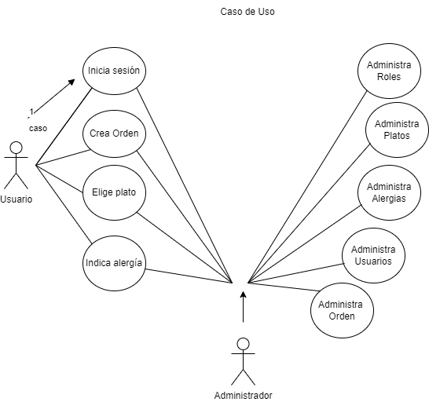

<h4>Usuario :</h4>
<h6>Inicio sesión de Usuario </h6>

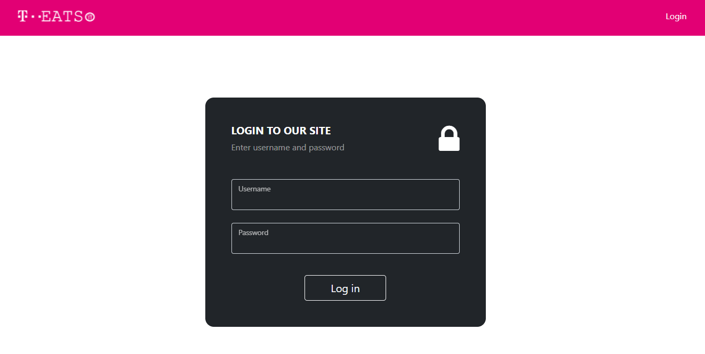

<h6>Ver catálogo de platos </h6>

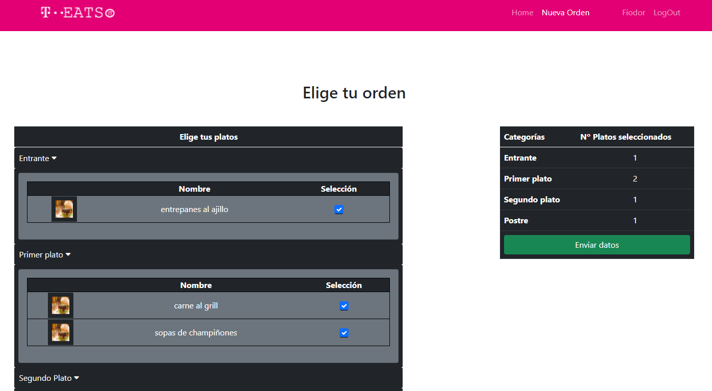

<h6>Realizar un pedido </h6>

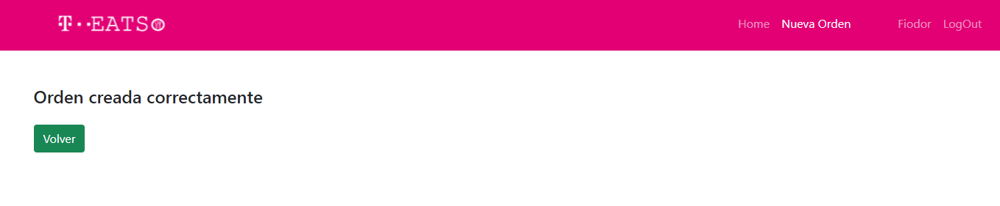

<h6>Editar perfil</h6>

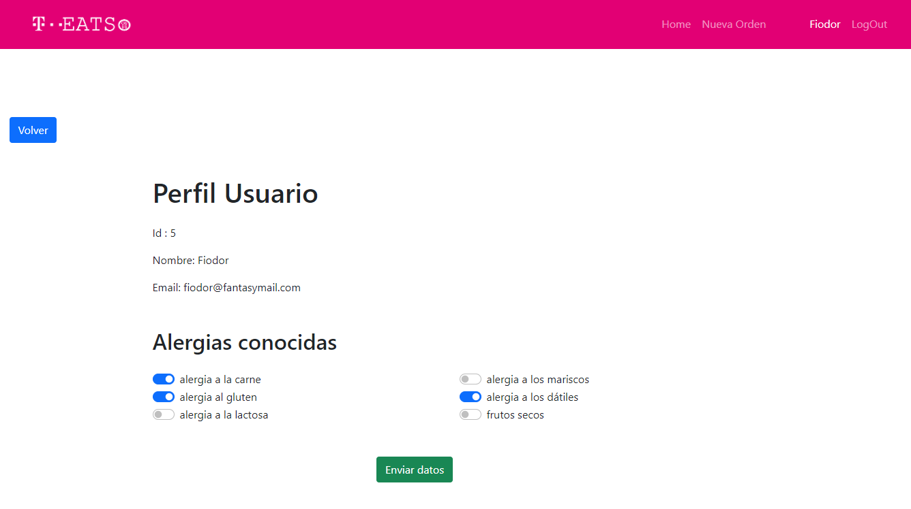

<h4>Administrador :</h4>
<h6>Vistas administrador </h6>

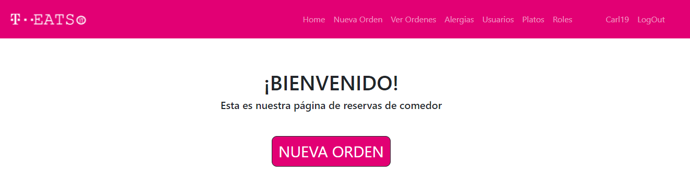

<h6>Editar catálogo de platos </h6>

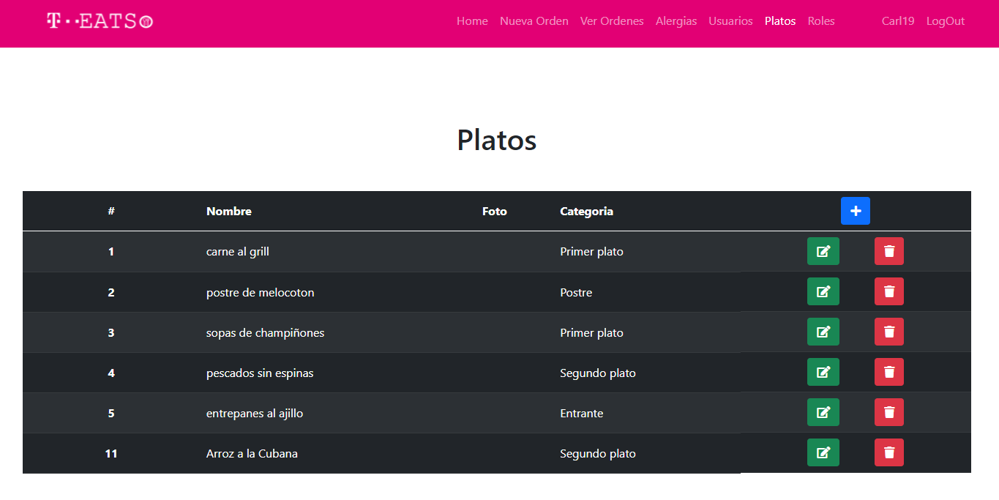

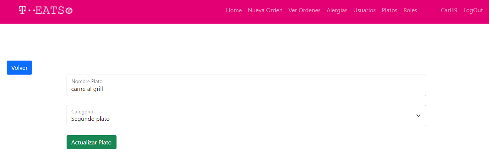

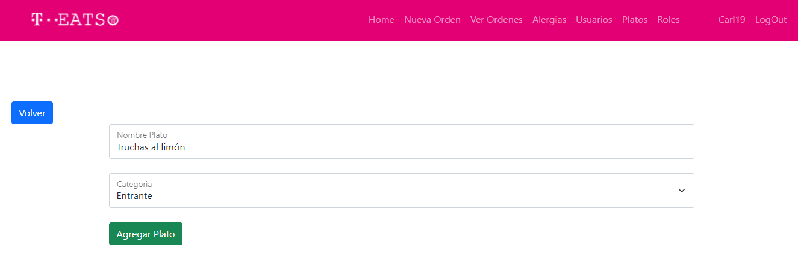

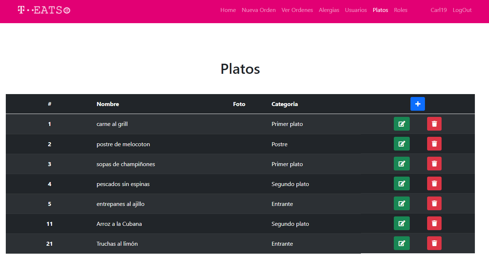

<h6>Administrar catálogo de órdenes </h6>

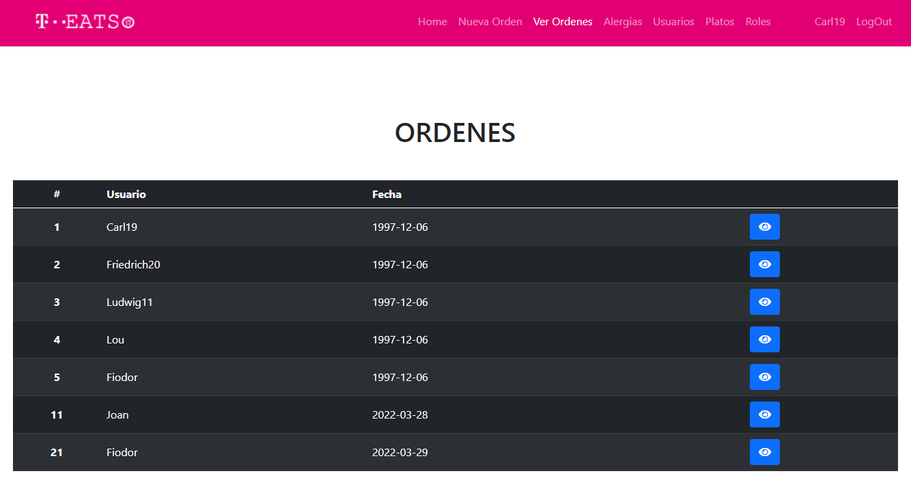

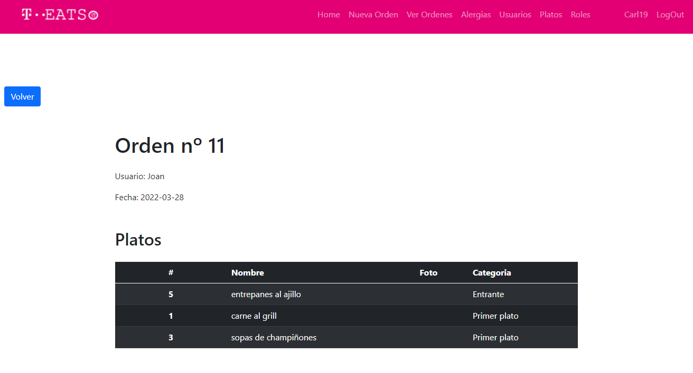

<h6>Administración de Usuarios</h6>

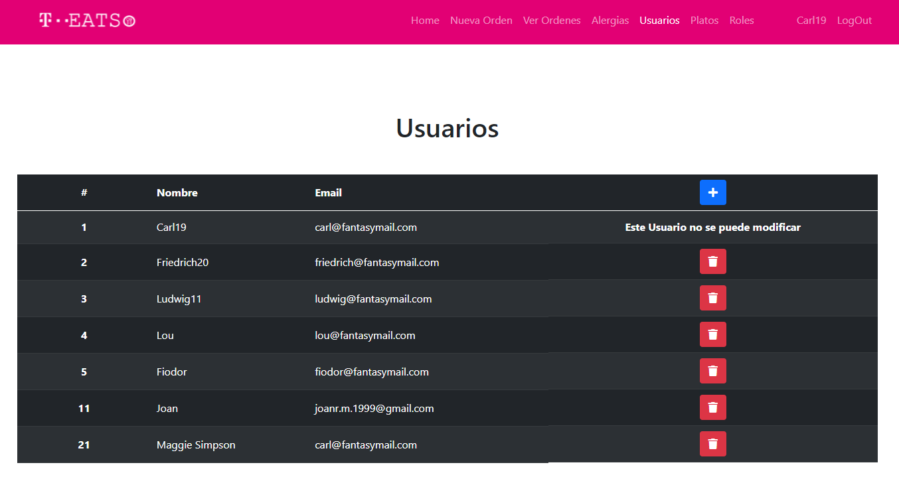

<h6>Administración de Roles</h6>

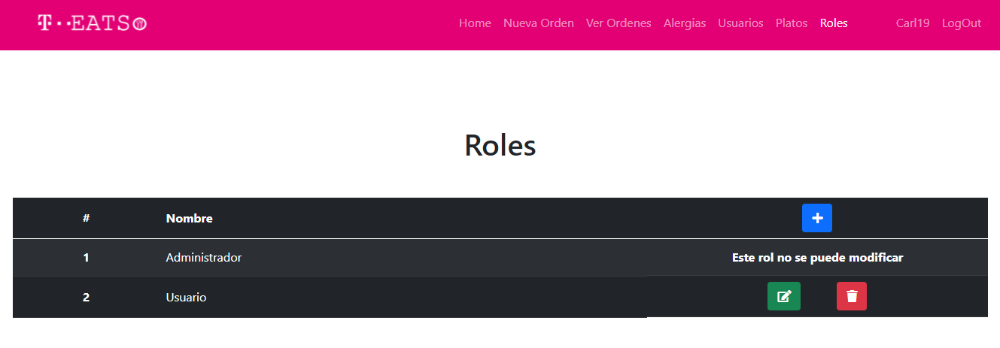

 

