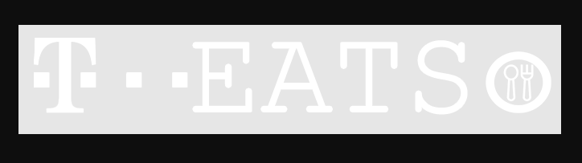
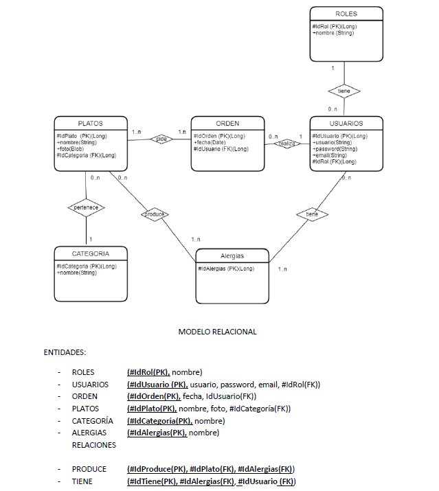
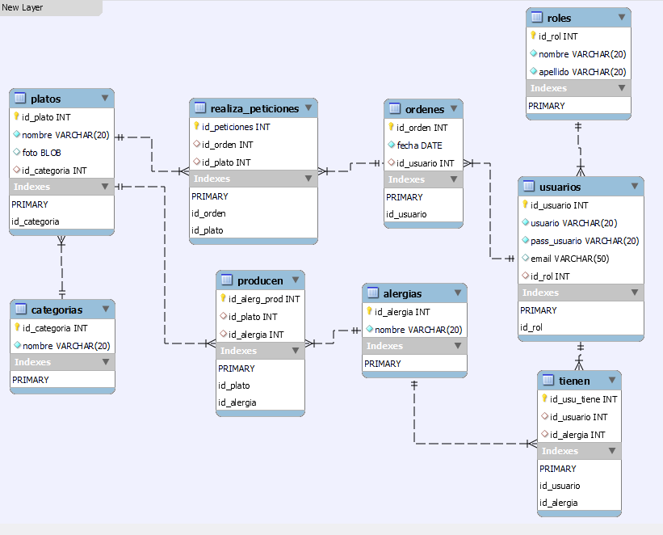

<h1 style="text-align: center; color : blueviolet; font-family : Courier New;">Proyecto Final Campus</h1>

<h2  style="font-family : Courier New; font-size : 25px;">Integrantes :</h2>

- Adrián Rodríguez.
- Isabel Calzadilla.
- Joan Rofes.

<h1 style="text-align: center; color : blueviolet ">Nombre de Aplicación : T-Eats.</h1>

<h2 style="font-family : Courier New; font-size : 25px;">Proyecto  </h2>

<h5 style="font-family : Courier New; font-size : 15px;">Tenemos como finalidad principal :

Descongestionar y optimizar la plataforma de petición de turnos de reservas en el comedor.

En la coyuntura actual provocada por el contexto del Coronavirus, una de las problemáticas inherentes ha sido la interacción en el ambiente laboral, con mayor énfasis en los espacios que se encuentran definidos para tales fines, como lo es el comedor de la empresa, siendo éste ya un elemento complicado por la cantidad de personas que congregará, aunado al contexto actual, presupone toda una nueva problemática para cualquier empresa, es por tal mótivo que nuestro proyecto intenta potenciar las respuestas tecnológicas con las que se les podría abordar, y lo que como grupo intentamos recalcar : optimizar los recursos al máximo para descongestionar y poosibilitar la prestación eficaz del servicio del comedor, previendo múltiples variables, como lo son la cantidad de aforo que actualmente se genera como requisito, además la facilidad de uso tanto para el usuario como para el potencial administrador, intentando hacer lo más factible la aplicabilidad en ambos casos.
</h5>

<h2 style="font-family : Courier New; font-size : 25px;">Tabla de contenidos : </h2>
<ol>
    <li><a href="#tecnologias">Tecnologías</a></li>
    <li><a href="#aplicacion">Aplicación</a></li>
    <li><a href="#api">Documentación API</a></li>  
    <li><a href="#modelo">Modelo Relacional Proyecto</a></li>  
</ol>

<h2 style="font-family : Courier New; font-size : 25px;" id="tecnologias">Tecnologías : </h2>
<ul>
<h4>Backend:</h4>
<li>Java 8.</li>
<li>MySql</li>
<li>Postman</li>
<li>SpringBoot 4.4.1</li>
<li>Swagger 2.9.</li>
<h4>Frontend:</h4>
<li>Angular 12</li>
<li>HTML5</li>
<li>CSS3</li>
<li>Bootstrap</li>
<h4>Organización :</h4>
<li>Trello</li>
<li>GitHub</li>
<h4>Despliegue :</h4>
<li>Heroku, despliegue API (Backend)</li>
<li>Amazon Web Services, despliegue de la aplicación (Frontend)</li>
</ul>

<h2 style="font-family : Courier New; font-size : 25px;" id="aplicacion">Aplicación : </h2>
   

<h3 style="font-family : Courier New; font-size : 18px;" id="aplicacion">Despliegue desde la Web: </h3>

- El despliegue de la aplicación para Backend consta de la base de datos con la arquitectura funcional de la API en HEROKU y que responderá a todos los Endpoints del Frontend.

- Proyecto desplegado en Amazon WebServices :

- Enlace :

- https://fontend.d3045ydvjws7ni.amplifyapp.com/login

<h2 style="font-family : Courier New; font-size : 25px;" id="api">Documentación API : </h2>

- https://reserva-restaurant-fe-jai.herokuapp.com/swagger-ui.html
    
 Recoge todos los Endpoints de la API.

<h2 style="font-family : Courier New; font-size : 25px;" id="modelo">Modelo Relacional : </h2>
    
 El modelo relacional que consideramos óptimo para el proyecto lo constituyen las siguientes Entidades y Relaciones.

<h3 style="font-family : Courier New; font-size : 20px;" >Resultado despliegue MySql : </h3>
    
Implementación del modelo relacional en MySQL.

 
