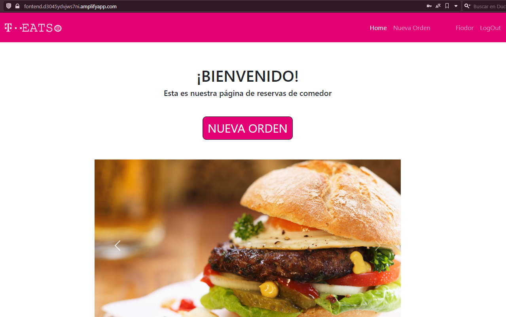
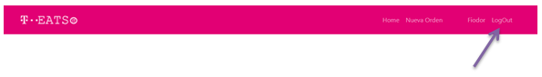

<h1 style="text-align: center; color : blueviolet; font-family : Courier New;">Proyecto Final Campus</h1>

<h2  style="font-family : Courier New; font-size : 25px;">Integrantes :</h2>

- Adrián Rodríguez.
- Isabel Calzadilla.
- Joan Rofes.

<h1 style="text-align: center; color : blueviolet ">Nombre de Aplicación : T-Eats.</h1>

<h2 style="font-family : Courier New; font-size : 25px;">Proyecto  </h2>

<h5 style="font-family : Courier New; font-size : 15px;">Tenemos como finalidad principal : 

Descongestionar y optimizar la plataforma de petición de turnos de reservas en el comedor. 

En la coyuntura actual provocada por el contexto del Coronavirus, una de las problemáticas inherentes ha sido la interacción en el ambiente laboral, con mayor énfasis en los espacios que se encuentran definidos para tales fines, como lo es el comedor de la empresa, siendo éste ya un elemento complicado por la cantidad de personas que congregará, aunado al contexto actual, presupone toda una nueva problemática para cualquier empresa, es por tal mótivo que nuestro proyecto intenta potenciar las respuestas tecnológicas con las que se les podría abordar, y lo que como grupo intentamos recalcar : optimizar los recursos al máximo para descongestionar y poosibilitar la prestación eficaz del servicio del comedor, previendo múltiples variables, como lo son la cantidad de aforo que actualmente se genera como requisito, además la facilidad de uso tanto para el usuario como para el potencial administrador, intentando hacer lo más factible la aplicabilidad en ambos casos.
</h5>

<h2 style="font-family : Courier New; font-size : 25px;">Tabla de contenidos : </h2>
<ol>
    <li><a href="#tecnologias">Tecnologías</a></li>
    <li><a href="#aplicacion">Aplicación</a></li>
    <li><a href="#casos">Casos de Uso</a> <ul><a href="#user">Usuario</a></ul><ul><a href="#admin">Administrador</a></ul></li>
     
</ol>

<h2 style="font-family : Courier New; font-size : 25px;" id="tecnologias">Tecnologías : </h2>
<ul>
<h4>Backend:</h4>
<li>Java 8.</li>
<li>MySql</li>
<li>Postman</li>
<li>SpringBoot 4.4.1</li>
<li>Swagger 2.9.</li>
<h4>Frontend:</h4>
<li>Angular 12</li>
<li>HTML5</li>
<li>CSS3</li>
<li>Bootstrap</li>
<h4>Organización :</h4>
<li>Trello</li>
<li>GitHub</li>
<h4>Despliegue :</h4>
<li>Heroku, despliegue API (Backend)</li>
<li>Amazon Web Services, despliegue de la aplicación (Frontend)</li>
</ul>

<h2 style="font-family : Courier New; font-size : 25px;" id="aplicacion">Aplicación : </h2>

<h3 style="font-family : Courier New; font-size : 18px;" id="aplicacion">Despliegue desde la Web: </h3>

- Proyecto desplegado en Amazon WebServices :

- Enlace :

- https://fontend.d3045ydvjws7ni.amplifyapp.com/

caso de uso :

Usuario :  Fiodor

Password : 123E

Para la aplicación desde la cónsola

- Instalación de CLI:

                npm install -g @angular/cli    
- Abrir la carpeta del proyecto :
    
                cd nombreProyecto
- Ejecutar el servidor :

                ng serve

<h2 style="font-family : Courier New; font-size : 25px;" id="casos">Casos de Uso : </h2>

<h4 style="font-family : Courier New; font-size : 25px;" id="user">Usuario :</h4>

- Enunciado :

Un nuevo empleado desea ingresar por primera vez a la plataforma para realizar una orden del catálogo dispuesto.

<h6>Inicio sesión de Usuario </h6>

- Ante todo el usuario deberá de ingresar a la plataforma con el usuario y la contraseña que se le ha asignado.

<h4>Home :</h4>

- Luego de autenticar su usuario e iniciar sesión, el usuario será dirigido al Homepage de la aplicación, desde donde podrá contemplar diferentes platos y generar una nueva orden, además de tener vistas a las opciones disponibles para el perfil usuario :

- Nueva Orden.
- Perfil.
- LogOut.

<h6>Ver catálogo de platos </h6>

- Para generar una petición, debemos de ubicar "Nueva Orden", donde seremos direccionados a los páneles de selección :

Panel 'Elige tus platos'

- Entrantes.
- Primer plato.
- Segundo plato.
- Postre.

Podremos indicar las opciones de nuestra preferencia, indicando cantidades o tipos de plato.

Panel 'Categorias N°Platos seleccionados'

El panel nos indicará las seleccionamos que realicemos tanto por categorias como por cantidades hasta que realicemos la orden.

<h6>Realizar un pedido </h6>

- Una vez el usuario se decida a ordenar, será direccionado a la vista de confirmación de la orden.

<h6>Editar perfil</h6>

- Otra de los recursos disponibles para el usuario, será la personalización de su perfil, con la posibilidad de indicar o no si dspone de alguna disposición especial en sus elecciones, específicamente sus alergias a los alimentos.

<h6>LogOut</h6>

Por último, el usuario dispone de la opció. 'LogOut' para salir de la aplicación una vez generada la orden u editado su perfil.

<h4 style="font-family : Courier New; font-size : 25px;" id="admin">Administrador :</h4>

- Enunciado :

Uno de los administradores de la aplicación desea editar, ver, agregar y eliminar registros del comedor para hacer limpieza del sitio.

Luego de auténticarse como 'Administrador', dispondrá de las vistas dispuestas exclusivamente para su rol.

- Home
- Nueva Orden
- Ver Ordenes
- Alergias
- Usuarios
- Platos
- Roles
- Perfil
- Salir

<h6>Vistas administrador </h6>

<h6>Editar catálogo de platos </h6>

Considerando qeu desea filtrar como administrador, para editar el catálogo de platos, se ha de ubicar en las secciones del menú y seleccionar.

Una vez seleccionada la opción nos imprime un panel exclusivamente administrativo con las opciones dispuestas para 

- Agregar
- Eliminar
- Editar

Selecciona la que le interese.

- Actualizar plato

La opción de actualizar permitirá al administrador modificar el nombre del plato y la categoría del mismo.

- Agregar plato

Si el administrador desea agregar platos, solo ha de seleccionar la imágen y será enviado al panel donde deberá de indicar el nombre del plato y la categoría del mismo, luego de ello confirmará su elección.

Comprobación de la adición de registro.

<h6>Administrar catálogo de órdenes </h6>

El administrador podrá acceder a las ordenes generadas por el usuario y ver sus registros, así como sus datos y detalles de la misma.

Al seleccionr el 'Detalle' de las ordenes, se le generará una vista con el detalle de la orden seleccionada, indicando :

- Número de orden.
- Usuario.
- Fecha.
- Platos : Código del plato, Nombre del plato, Categoría del plato.

<h6>Administración de Usuarios</h6>

De igual forma, podrá gestionar a los usuarios, agregando u eliminado según lo necesite.

<h6>Administración de Roles</h6>

El administrador podrá gestionar los roles de la base de datos, agregando según el tipo de rol a representar : Administrador, quien tendrá la misma accesibilidad que él para gestionar y el rol de usuario, quién solo podrá hacer ordenes, editar perfil.

 

